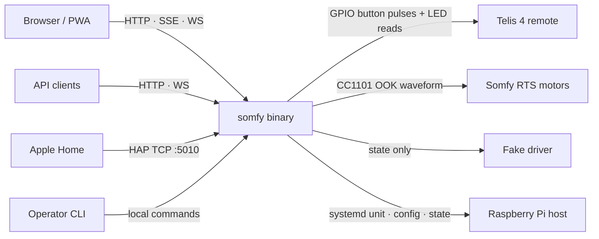
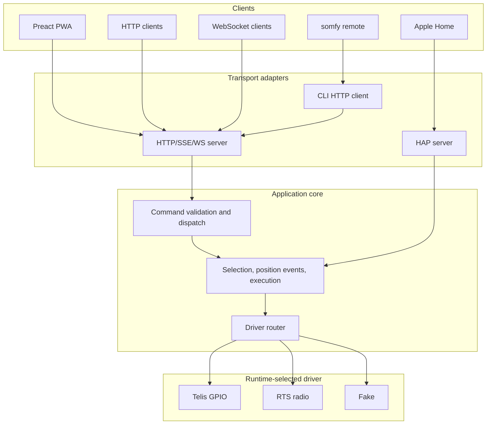
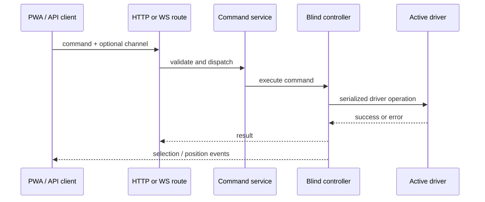
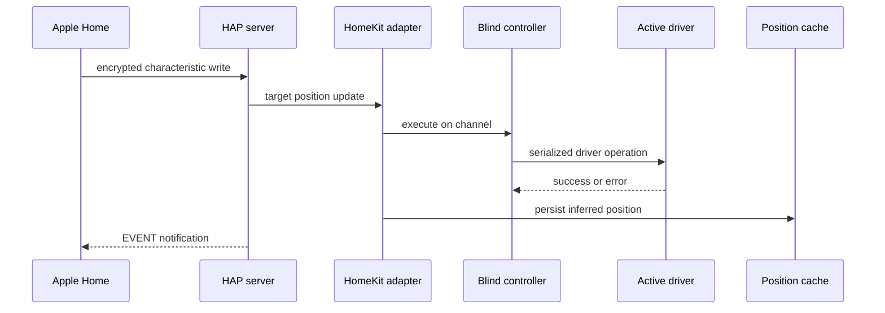

# Architecture

`somfy` is a single Rust binary that exposes one Somfy blind installation through a web UI, HTTP/SSE/WebSocket APIs, native HomeKit, and an operator CLI. The same command model drives three interchangeable hardware backends: a wired Telis remote, a direct RTS radio, or a fake driver for development.

The important architectural rule is that transports do not know which driver is active. Hardware selection is runtime configuration, while the user-facing control surface stays stable.

## System Context

At runtime there are two broad responsibilities in the binary:

- **Blind control:** accept commands, serialize hardware access, update live state, and publish position/selection events.
- **Host management:** install, upgrade, diagnose, configure, and operate the systemd service on the Pi.

The operator commands support the service, but they are not in the live command path.

## Design Goals

- Keep one stable command surface for the PWA, API clients, CLI remote mode, and HomeKit.
- Make the hardware driver a replaceable runtime choice, not a compile-time product variant.
- Serialize physical operations so GPIO pulses, Telis selection changes, and RTS radio transmissions never interleave.
- Preserve RTS rolling-code safety even across crashes and power loss.
- Run without Node or Homebridge on the Pi; the release artifact is one self-managing binary with embedded frontend assets.
- Treat the Pi as an appliance: install, upgrade, health checks, and rollback are built into the CLI.

## Control Plane

HTTP, WebSocket, and the PWA enter through the same request validation and dispatch path. HomeKit uses the same controller and driver router, but bypasses the HTTP-oriented service layer because HAP already has its own protocol semantics and accessory model.

The CLI has two modes:

- Local operator commands such as `install`, `upgrade`, `doctor`, and `config` manipulate host state or service configuration.
- `somfy remote ...` acts like an API client and posts to the running service.

## Boundaries

### Transport Boundary

The wire API is expressed in terms of `Channel` and `Command`: `L1`-`L4`, `ALL`, and actions such as `up`, `down`, `stop`, `select`, `prog`, and `prog_long`. Transport adapters are responsible for parsing protocol-specific input and returning protocol-specific output, but they should not implement hardware behavior.

Live state is pushed through:

- SSE for the PWA's primary state stream.
- WebSocket for bidirectional API clients.
- HAP event notifications for Apple Home.

### Application Boundary

The application core owns the rules that should be consistent across clients:

- whether a command shape is valid;
- whether pairing commands are supported by the active driver;
- how optional target channels are resolved;
- when selection changes are broadcast;
- how inferred position updates are generated after movement commands.

The system has no motor position sensors. Position is an application-level inference: successful `up` maps to open (`100`), successful `down` maps to closed (`0`), and `ALL` fans out to the individual channels so HomeKit remains consistent.

### Driver Boundary

The driver router is the hardware seam. Every driver exposes the same command operations and selected-channel stream, but each driver has different physical constraints:

| Driver | Architecture Role | State Source |
| ------ | ----------------- | ------------ |
| `fake` | Development and CI backend with no hardware effects. | In-memory state. |
| `telis` | Presses a wired Telis 4 remote and reads LEDs to observe selected channel. | Physical remote LEDs. |
| `rts` | Acts as five virtual RTS remotes (`L1`-`L4`, `ALL`) through a CC1101 radio. | Persisted RTS state file. |

All drivers are compiled into the binary. The active driver is selected by `/etc/somfy/config.toml` at startup. Pi Linux defaults to Telis if no config exists; other targets default to fake.

## Runtime Flows

### Web Command

The service layer handles the client-facing command contract. `select` changes the public selected channel. Movement and pairing commands with an explicit channel target that channel directly; commands without a channel use the current selection.

### HomeKit Command

HomeKit exposes five `WindowCovering` accessories: `L1`-`L4` and `ALL`. Writes are snapped to endpoints because the motors provide no position feedback. A write that matches cached state is treated as a no-op, which prevents iOS from replaying stale target positions into physical movement after pairing or reconnect.

### RTS Transmission

The RTS driver has additional safety work before it emits RF:

1. Reserve a block of rolling codes on disk.
2. Encode and obfuscate a Somfy RTS frame for the target channel.
3. Build a Manchester pulse train.
4. Ask pigpiod to clock the GDO0 waveform while the CC1101 is in transmit mode.
5. Advance the in-memory rolling code only after a successful transmission.

The persisted reserve may skip unused codes after a crash. That is intentional: losing spare codes is safer than replaying an old code that a motor has already accepted.

## Concurrency Model

Blind operations are serialized at the controller boundary. HTTP, WebSocket, CLI remote, and HomeKit all enter the same controller queue before they reach a driver. This makes each client command atomic before it reaches driver-specific targeting or selection behavior.

Drivers still keep local locks around hardware resources:

- Telis uses one execution lock around GPIO output and selection sequences.
- RTS uses one transmission lock around radio configuration and pigpiod waveform operations.
- WebSocket commands run asynchronously so connection keepalives and selection updates can continue while command work waits behind the controller queue.

Selection notifications and position broadcasts are separate from hardware locks, so observers can continue receiving state while a command is queued or executing.

These locks are correctness mechanisms, not trust boundaries. They prevent malformed timing and state races; they do not authenticate clients.

## Persistence

Runtime state lives under `$STATE_DIRECTORY` when systemd manages the service. Release builds otherwise use `/var/lib/somfy`; debug builds can use local state for development.

| File | Owner | Purpose |
| ---- | ----- | ------- |
| `rts.json` | RTS driver | Virtual remote IDs, selected RTS channel, and rolling-code reserves. |
| `hap.json` | HAP state | HomeKit identity, setup data, long-term key, config number, and pairings. |
| `positions.json` | HomeKit adapter | Last inferred HomeKit positions for each accessory. |

State files are written with a temp-file plus atomic rename pattern. Security-sensitive HomeKit state is stored with restrictive permissions. The service does not replay persisted positions into GPIO or RF on startup; position state is for client continuity, not physical reconciliation.

## Deployment Architecture

The release artifact is one binary:

- clap subcommands provide the operator and remote CLI;
- the Axum server serves HTTP, SSE, WebSocket, and embedded PWA assets;
- the HAP server runs a separate TCP listener on port `5010`;
- driver implementations are all present and selected by config;
- build metadata is embedded at compile time for `--version`, `doctor`, and upgrade reporting.

`somfy install` writes the systemd unit and prepares driver prerequisites. If the resolved driver is RTS, install/configuration also ensures pigpiod is loopback-only because pigpiod has no authentication. `somfy upgrade` downloads a new release, verifies it, swaps the binary, restarts the service, and rolls back if the replacement fails to come up.

`somfy doctor` is the deployment health contract. It checks unit drift, service state, permissions, updates, deployed version, and driver-specific prerequisites. HomeKit pairing lifecycle is intentionally kept under `somfy homekit ...`.

## Architectural Decisions

| Decision | Why It Exists | Tradeoff |
| -------- | ------------- | -------- |
| Runtime driver selection | One UI/API can support wired Telis, direct RTS, and development without rebuilding. | Driver-specific behavior must be normalized at the application boundary. |
| Telis LEDs as selection truth | The physical remote may be changed outside the app, so LEDs are the most accurate state source. | Selection changes require debounce logic and GPIO input wiring. |
| RTS write-ahead rolling codes | Prevents replay after crashes or partial transmissions. | Crashes can intentionally burn unused reserved codes. |
| Native HAP server | Removes Homebridge and Node from the appliance. | The repo owns HAP protocol, crypto, pairing, and event semantics. |
| pigpiod for RTS timing | 640 microsecond Manchester half-symbols need timing outside the async runtime. | The Pi must run a local pigpiod daemon locked to loopback. |
| Inferred positions | Gives HomeKit and the UI useful state without motor encoders. | State means "last commanded endpoint", not measured blind position. |

## Code Map

This section is a pointer into the implementation, not the architecture itself.

| Area | Primary Paths |
| ---- | ------------- |
| CLI and operator commands | `src/cli.rs`, `src/commands/` |
| HTTP, SSE, WebSocket, static assets | `src/server.rs`, `src/embed.rs` |
| Command validation and dispatch | `src/service/` |
| Selection, execution, position events | `src/controller.rs` |
| Shared command and channel types | `src/core/` |
| Config resolution and validation | `src/config.rs` |
| Driver routing and implementations | `src/driver/`, `src/gpio.rs`, `src/rts/` |
| HomeKit application adapter | `src/homekit/` |
| HAP protocol stack | `src/hap/` |
| Frontend PWA | `app/` |
| systemd and deployment helpers | `src/systemd.rs`, `src/deploy/`, `assets/` |

## Related Docs

- [HARDWARE.md](HARDWARE.md) covers Telis wiring, CC1101 setup, GPIO behavior, and pairing workflows.
- [RTS_DRIVER.md](RTS_DRIVER.md) is the protocol reference for RTS frames, waveform timings, rolling codes, pigpiod, and CC1101 configuration.
- [HAP.md](HAP.md) covers HomeKit pairing, persistent identity, characteristic behavior, encrypted sessions, and event push.
