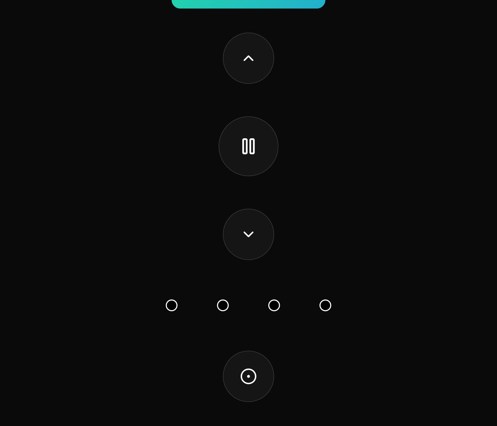

## RemoteGPIO

Before the WebSocket connects, a loading indicator appears at the top.



After the connection is established, the client can control the server in real time over WebSocket. Because only one physical remote is attached to the Raspberry Pi, the selected shutter state is global and synchronized across all WebSocket clients. The server keeps this shared state by reading the GPIO pins.

<video src="https://github.com/user-attachments/assets/4dbb72bf-5b67-4a23-8322-f3749d19901c" autoplay loop muted playsinline></video>

### Build

You need to have [cross](https://github.com/rust-embedded/cross) installed.

```bash
cargo install cross --git https://github.com/cross-rs/cross
```

As well as [podman](https://podman.io/) and `jq`.

```bash
brew install podman jq
```

### Usage

**Important:** Set the `RASPBERRY_PI_IP` and `REMOTE_DIR` in the `remote-gpio.sh` file according to your setup.

```bash
./remote-gpio.sh start
```

If you are done, you can remove the application from the Raspberry Pi and the container from your machine.

```bash
./remote-gpio.sh delete
```

### Troubleshooting

If the pins are already in use, you can check the list of open files on the Raspberry Pi.

```bash
lsof | grep gpio
```
