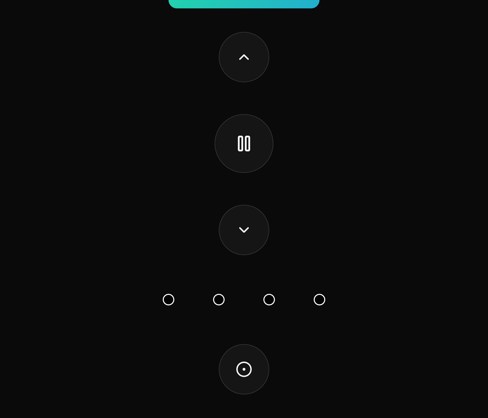

## RemoteGPIO



### Build

You need to have [cross](https://github.com/rust-embedded/cross) installed.

```bash
cargo install cross --git https://github.com/cross-rs/cross
```

As well as [podman](https://podman.io/) and `jq`.

```bash
brew install podman jq
```

### Usage

**Important:** Set the `RASPBERRY_PI_IP` and `REMOTE_DIR` in the `remote-gpio.sh` file according to your setup.

```bash
./remote-gpio.sh start
```

If you are done, you can remove the application from the Raspberry Pi and the container from your machine.

```bash
./remote-gpio.sh delete
```

### Troubleshooting

If the pins are already in use, you can check the list of open files on the Raspberry Pi.

```bash
lsof | grep gpio
```
